<div align="center">

<!-- PROJECT LOGO -->


<br/>

# NoteNest — An AI-Powered Academic Resource Management Platform

<p align="center">
  <em> # Organize smarter. Study deeper. Excel further.</em>
</p>

<br/>

<!-- TECH BADGES -->
[](https://php.net)
[](https://mysql.com)
[](https://getbootstrap.com)
[](https://developer.mozilla.org/en-US/docs/Web/JavaScript)

[](https://groq.com)
[](https://developers.google.com/classroom)
[](https://trychroma.com)
[](https://docker.com)

<!-- STATUS BADGES -->
[]()
[]()
[]()
[]()
[](https://infinityfree.net)

<br/>

<!-- LIVE DEMO BUTTON -->
[](https://notenest-ai.ct.ws/login.php)
[](https://youtu.be/dPQg-9itxqM)

> 🎥 Click the **Watch Demo** badge above to watch a full walkthrough of NoteNest AI's features.

<br/>

<!-- NAVIGATION -->
**[📸 Screenshots](#-screenshots)**
&nbsp;·&nbsp;
**[⚡ Quick Start](#-installation--setup)**
&nbsp;·&nbsp;
**[✨ Features](#-features)**
&nbsp;·&nbsp;
**[🏗️ Architecture](#️-system-architecture)**
&nbsp;·&nbsp;
**[🗄️ Database](#️-database-design)**
&nbsp;·&nbsp;
**[👥 Team](#-team--contributions)**
&nbsp;·&nbsp;
**[🎬 Demo](#-demo-video)**

<br/>

> **NoteNest** is an intelligent academic resource management and AI-powered learning platform.
> Built with PHP, MySQL, Bootstrap, JavaScript, Groq AI and Google Classroom API —
> it brings your entire academic life into one seamless, intelligent dashboard.
>
> 🌐 **Live at: [notenest-ai.ct.ws](https://notenest-ai.ct.ws/login.php)**

</div>

<br/>

<div align="center">

```
╔══════════════════════════════════════════════════════════════════╗
║  📘 Courses  ·  📁 Files  ·  🤖 AI Tutor  ·  📝 AI Exam       ║
║  🏫 Google Classroom  ·  📊 Analytics  ·  🎙️ Lecture Recorder  ║
╚══════════════════════════════════════════════════════════════════╝
```

</div>

## 👥 Team & Contributions

<div align="center">

<h3>👨‍🏫 Project Supervisor</h3>
<p>
  <b>Ahmed Adnan</b><br/>
  Department of Computer Science & Engineering<br/>
  East West University<br/>
  <i>Course: Software Engineering (CSE412)</i>
</p>

<h3>🏆 Core Development Team</h3>

<table align="center">
  <tr>
    <td align="center" width="33%">
      👑<br/>
      <b>Kamran Hasan</b><br/>
      <code>2022-2-60-077</code><br/>
      <a href="https://github.com/kkamranhasan">@kkamranhasan</a>
    </td>
    <td align="center" width="33%">
      🎨<br/>
      <b>Natasa Tanjila Arshi</b><br/>
      <code>2023-3-60-387</code><br/>
      <a href="https://github.com/Natasha-Error203">@Natasha-Error203</a>
    </td>
    <td align="center" width="33%">
      🗄️<br/>
      <b>Umme Sumaya</b><br/>
      <code>2022-2-60-035</code><br/>
      <a href="https://github.com/Sumaya531">@Sumaya531</a>
    </td>
  </tr>
  <tr>
    <td align="center">
      🔗<br/>
      <b>Md Abdur Rahman</b><br/>
      <code>2023-3-60-024</code><br/>
      <a href="https://github.com/abdur-93">@abdur-93</a>
    </td>
    <td align="center">
      🤖<br/>
      <b>Anika Binte Rashel</b><br/>
      <code>2022-3-60-336</code><br/>
      <a href="https://github.com/rayahkhondaker21-commits">@rayahkhondaker21-commits</a>
    </td>
    <td align="center">
      🧪<br/>
      <b>MD. Yeasin Zaman Niyaj</b><br/>
      <code>2022-1-60-210</code><br/>
      <a href="mailto:yeasinzaman.yz78@gmail.com">Contact</a>
    </td>
  </tr>
</table>

<br/>

> 🎓 <b>Academic Project — Group Submission</b>

</div>

---

## 📖 Project Overview

**NoteNest AI** was born from a real frustration: students today juggle multiple platforms — Google Classroom for coursework, cloud drives for files, separate apps for notes, and ChatGPT for studying — creating a fragmented, inefficient learning experience.

### 🎯 The Problem

| Pain Point | Common Student Experience |
|---|---|
| 📂 Disorganized notes | Files scattered across drives, devices, and apps |
| 🔄 Manual syncing | Manually downloading course materials from Google Classroom |
| 📚 Passive studying | No personalized AI guidance or adaptive exam preparation |
| 📊 No progress insight | Unable to track learning patterns and weak areas |
| 🎙️ Lost lecture content | No easy way to record and store lectures alongside notes |

### 💡 The Solution

**NoteNest AI** unifies everything into a single, intelligent platform — course management, Google Classroom sync, AI tutoring, AI exam generation, lecture recording, and progress analytics — all powered by Groq's Llama 3.3 70B model.

### 👥 Target Users

- 🎓 **University & college students** managing academic workload
- 📚 **Self-learners** building structured study materials
- 🏫 **Study groups** sharing and collaborating on notes
- 📝 **Final year students** needing AI-powered exam preparation

---

## ✨ Features

### 🔐 Authentication & User Management

| Feature | Description |
|---|---|
| Secure Registration | Email/password registration with avatar upload |
| Email Verification | OTP-style email verification via Gmail SMTP + PHPMailer |
| Session Protection | Route guards on all internal pages via `auth.php` |
| Password Hashing | Bcrypt (`password_hash()`) for secure credential storage |
| Profile Management | Update name, avatar, and change password |

### 📘 Course & Academic Management

| Feature | Description |
|---|---|
| Course Creation | Create and manage custom courses with descriptions |
| Topic Management | Hierarchical topic structure within each course |
| Folder System | Unlimited nested folders for organized file storage |
| File Upload | Upload PDF, DOCX, XLSX, images, audio, video, code files |
| File Preview | In-browser preview using PDF.js, Mammoth.js, SheetJS |
| One-Click Download | Instantly download individual files or folder contents |

### 🏫 Google Classroom Integration

| Feature | Description |
|---|---|
| Google OAuth 2.0 | Secure account connection with Classroom & Drive scopes |
| Course & Topic Sync | Auto-import enrolled courses, topics & syllabus structure |
| Material Download | Download attachments directly into NoteNest storage |
| Assignment Sync | Import assignment titles, due dates into To-Do & Calendar |
| AJAX Drill-Down | Browse Courses → Topics → Files without page reloads |
| AI Assignment Analysis | Groq AI scores difficulty, estimates hours, gives study tips |
| Interactive Calendar | Visual monthly calendar auto-populated with deadlines |
| Background Sync | Cron jobs keep materials fresh & send assignment reminders |

### 🤖 AI-Powered Features

| Feature | Description |
|---|---|
| AI Tutor Chat | Ask any academic question, get Markdown-formatted answers |
| Persistent Chat History | All AI conversations saved and resumable per session |
| AI Exam Wizard | Upload notes → AI generates customized MCQ & Short Answer exams |
| AI Answer Evaluation | Submit exam answers → AI scores, evaluates, gives feedback |
| Study Recommendations | AI-personalized learning plans and weekly study schedules |
| Semantic Search (RAG) | Python ChromaDB microservice for document semantic search |

### ⭐ Productivity & Collaboration

| Feature | Description |
|---|---|
| Favorites | Star important files and folders for quick access |
| Lecture Recorder | In-browser audio recorder with real-time waveform visualization |
| To-Do Manager | Task checklist with priority tags (High/Medium/Low) and due dates |
| File Sharing | Share files and folders with classmates via email |
| Recursive Access | Sharing a folder grants view-only access to all sub-items |
| Notifications | System notification center for reminders and alerts |

### 📊 Analytics & Insights

| Feature | Description |
|---|---|
| Progress Analytics | Activity heatmaps, exam score bar charts (Chart.js) |
| AI Learning Insights | Personalized feedback on study habits and weak topics |
| Storage Tracking | Real-time storage usage sync |
| Sync Audit Logs | Full audit trail of all Google Classroom sync events |

---

## 🛠️ Technology Stack

<div align="center">

| Layer | Technology | Purpose |
|---|---|---|
| 🖥️ **Backend** | PHP 8.x | Core server-side logic, routing, API calls |
| 🗄️ **Database** | MySQL 8.x | Relational data storage with prepared statements |
| 🎨 **Frontend** | Bootstrap 5.3 + Vanilla JS + jQuery | Responsive UI, AJAX interactions |
| 🤖 **AI Engine** | Groq API — `llama-3.3-70b-versatile` | Tutoring, exam generation, analysis |
| 🔍 **Vector Search** | ChromaDB + Python FastAPI | Semantic RAG document search |
| 🔗 **Integrations** | Google Classroom API + Drive API (OAuth 2.0) | Course and material sync |
| 📧 **Email** | PHPMailer + Gmail SMTP | Verification emails and reminders |
| 📄 **Doc Parsing** | Mammoth.js · SheetJS · PDF.js | In-browser document preview |
| 📈 **Charts** | Chart.js | Analytics visualizations |
| 🐳 **DevOps** | Docker + Docker Compose | Containerized deployment |

</div>

---

## 🏗️ System Architecture

### High-Level Architecture

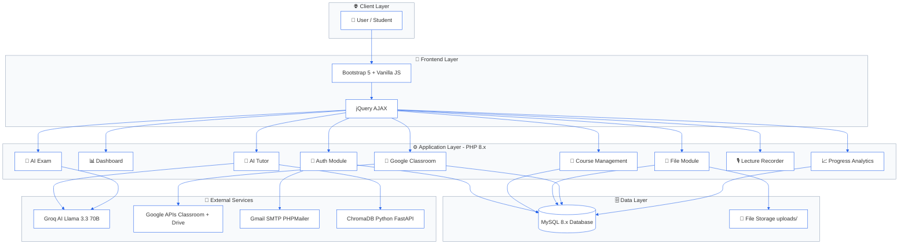
```mermaid
%%{init: {
  'theme': 'default',
  'themeVariables': {
    'darkMode': false,
    'background': '#ffffff',
    'mainBkg': '#ffffff',
    'nodeBorder': '#2563eb',
    'primaryColor': '#ffffff',
    'primaryTextColor': '#0f172a',
    'primaryBorderColor': '#2563eb',
    'lineColor': '#2563eb',
    'clusterBkg': '#f8fafc',
    'clusterBorder': '#94a3b8',
    'edgeLabelBackground': '#ffffff'
  }
}}%%
graph TB
    subgraph CLIENT["🌐 Client Layer"]
        U[👤 User / Student]
    end

    subgraph FRONTEND["🎨 Frontend Layer"]
        UI[Bootstrap 5 + Vanilla JS]
        AJAX[jQuery AJAX]
    end

    subgraph APP["⚙️ Application Layer - PHP 8.x"]
        AUTH[🔐 Auth Module]
        DASH[📊 Dashboard]
        COURSE[📘 Course Management]
        FILE[📁 File Module]
        GC[🏫 Google Classroom]
        AI_T[🤖 AI Tutor]
        AI_E[📝 AI Exam]
        REC[🎙️ Lecture Recorder]
        ANALYTICS[📈 Progress Analytics]
    end

    subgraph EXTERNAL["🔌 External Services"]
        GROQ[Groq AI Llama 3.3 70B]
        GOOG[Google APIs Classroom + Drive]
        SMTP[Gmail SMTP PHPMailer]
        CHROMA[ChromaDB Python FastAPI]
    end

    subgraph DATA["🗄️ Data Layer"]
        MYSQL[(MySQL 8.x Database)]
        UPLOADS[📂 File Storage uploads/]
    end

    U --> UI
    UI --> AJAX
    AJAX --> AUTH
    AJAX --> DASH
    AJAX --> COURSE
    AJAX --> FILE
    AJAX --> GC
    AJAX --> AI_T
    AJAX --> AI_E
    AJAX --> REC
    AJAX --> ANALYTICS

    AUTH --> MYSQL
    COURSE --> MYSQL
    FILE --> MYSQL
    FILE --> UPLOADS
    GC --> GOOG
    GC --> MYSQL
    AI_T --> GROQ
    AI_E --> GROQ
    AI_T --> CHROMA
    AUTH --> SMTP
    ANALYTICS --> MYSQL
```

### 🔄 Request Flow — Google Classroom Sync

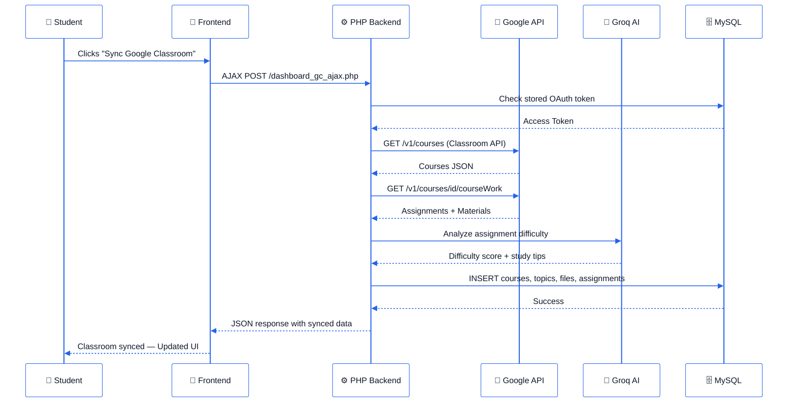
```mermaid
%%{init: {
  'theme': 'default',
  'themeVariables': {
    'darkMode': false,
    'background': '#ffffff',
    'actorBkg': '#ffffff',
    'actorBorder': '#2563eb',
    'actorTextColor': '#0f172a',
    'actorLineColor': '#2563eb',
    'signalColor': '#2563eb',
    'signalTextColor': '#0f172a',
    'labelBoxBkgColor': '#f8fafc',
    'labelBoxBorderColor': '#cbd5e1',
    'labelTextColor': '#0f172a',
    'loopTextColor': '#0f172a',
    'noteBkgColor': '#f8fafc',
    'noteTextColor': '#0f172a'
  }
}}%%
sequenceDiagram
    participant S as 👤 Student
    participant F as 🎨 Frontend
    participant P as ⚙️ PHP Backend
    participant G as 🏫 Google API
    participant AI as 🤖 Groq AI
    participant DB as 🗄️ MySQL

    S->>F: Clicks "Sync Google Classroom"
    F->>P: AJAX POST /dashboard_gc_ajax.php
    P->>DB: Check stored OAuth token
    DB-->>P: Access Token
    P->>G: GET /v1/courses (Classroom API)
    G-->>P: Courses JSON
    P->>G: GET /v1/courses/id/courseWork
    G-->>P: Assignments + Materials
    P->>AI: Analyze assignment difficulty
    AI-->>P: Difficulty score + study tips
    P->>DB: INSERT courses, topics, files, assignments
    DB-->>P: Success
    P-->>F: JSON response with synced data
    F-->>S: Classroom synced — Updated UI
```

---

## 🗄️ Database Design

### Entity Relationship Diagram

> 📊 Full ER diagram covering all **26 database tables** and their relationships.

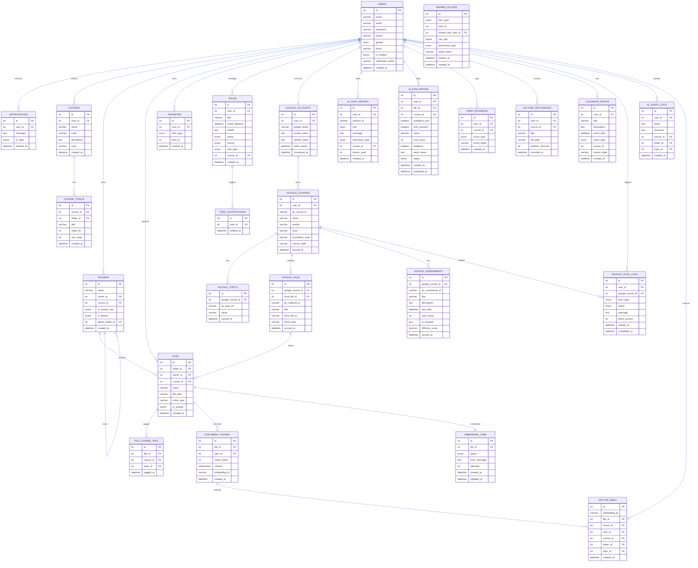
```mermaid
%%{init: {
  'theme': 'default',
  'themeVariables': {
    'darkMode': false,
    'background': '#ffffff',
    'primaryColor': '#ffffff',
    'primaryTextColor': '#0f172a',
    'primaryBorderColor': '#2563eb',
    'lineColor': '#2563eb',
    'tertiaryColor': '#f8fafc',
    'attributeBackgroundColorEven': '#ffffff',
    'attributeBackgroundColorOdd': '#f8fafc'
  }
}}%%
erDiagram
    USERS {
        int id PK
        varchar name
        varchar email
        varchar password
        varchar phone
        enum gender
        varchar photo
        tinyint is_verified
        varchar verification_token
        datetime created_at
    }
    NOTIFICATIONS {
        int id PK
        int user_id FK
        text message
        tinyint is_read
        datetime created_at
    }
    COURSES {
        int id PK
        int user_id FK
        varchar name
        varchar code
        text description
        varchar color
        datetime created_at
    }
    FOLDERS {
        int id PK
        varchar name
        int owner_id FK
        int course_id FK
        tinyint is_course_root
        tinyint is_shared
        int parent_folder_id FK
        datetime created_at
    }
    COURSE_TOPICS {
        int id PK
        int course_id FK
        int folder_id FK
        varchar title
        int week_no
        int sort_order
        datetime created_at
    }
    FILES {
        int id PK
        int folder_id FK
        int owner_id FK
        int course_id FK
        varchar name
        varchar file_path
        varchar mime_type
        tinyint is_shared
        datetime created_at
    }
    FILE_COURSE_TAGS {
        int id PK
        int file_id FK
        int course_id FK
        int topic_id FK
        datetime tagged_at
    }
    SHARED_ACCESS {
        int id PK
        enum item_type
        int item_id
        int shared_with_user_id FK
        tinyint can_edit
        enum permission_type
        varchar share_token
        datetime expires_at
        datetime created_at
    }
    FAVORITES {
        int id PK
        int user_id FK
        enum item_type
        int item_id
        datetime created_at
    }
    TODOS {
        int id PK
        int user_id FK
        varchar title
        datetime event_datetime
        text details
        enum status
        enum priority
        enum task_type
        int course_id FK
        datetime created_at
    }
    TODO_NOTIFICATIONS {
        int id PK
        int todo_id FK
        datetime notified_at
    }
    AI_CHAT_HISTORY {
        int id PK
        int user_id FK
        varchar session_id
        enum role
        text message
        enum interaction_type
        int course_id FK
        int tokens_used
        datetime created_at
    }
    AI_EVALUATIONS {
        int id PK
        int user_id FK
        int file_id FK
        int course_id FK
        longtext questions_json
        longtext user_answers
        decimal score
        int max_score
        longtext feedback
        text weak_areas
        enum status
        datetime created_at
        datetime evaluated_at
    }
    USER_PROGRESS {
        int id PK
        int user_id FK
        int course_id FK
        enum event_type
        varchar event_detail
        datetime created_at
    }
    LECTURE_RECORDINGS {
        int id PK
        int user_id FK
        int course_id FK
        varchar title
        varchar file_path
        int duration_seconds
        datetime recorded_at
    }
    GOOGLE_ACCOUNTS {
        int id PK
        int user_id FK
        varchar google_email
        text access_token
        text refresh_token
        datetime token_expiry
        datetime connected_at
    }
    GOOGLE_COURSES {
        int id PK
        int user_id FK
        varchar gc_course_id
        varchar name
        varchar section
        varchar room
        varchar enrollment_code
        varchar course_state
        datetime synced_at
    }
    GOOGLE_TOPICS {
        int id PK
        int google_course_id FK
        varchar gc_topic_id
        varchar name
        datetime synced_at
    }
    GOOGLE_FILES {
        int id PK
        int google_course_id FK
        int local_file_id FK
        varchar gc_material_id
        varchar title
        varchar drive_file_id
        varchar mime_type
        datetime synced_at
    }
    GOOGLE_ASSIGNMENTS {
        int id PK
        int google_course_id FK
        varchar gc_coursework_id
        varchar title
        text description
        datetime due_date
        int max_points
        text ai_analysis
        decimal difficulty_score
        datetime synced_at
    }
    GOOGLE_SYNC_LOGS {
        int id PK
        int user_id FK
        int google_course_id FK
        enum sync_type
        enum status
        text message
        int items_synced
        datetime started_at
        datetime completed_at
    }
    CALENDAR_EVENTS {
        int id PK
        int user_id FK
        varchar title
        text description
        datetime event_date
        enum event_type
        int source_id
        varchar source_table
        datetime created_at
    }
    DOCUMENT_CHUNKS {
        int id PK
        int file_id FK
        int user_id FK
        int chunk_index
        mediumtext content
        varchar embedding_id
        datetime created_at
    }
    EMBEDDING_JOBS {
        int id PK
        int file_id FK
        enum status
        text error_message
        int attempts
        datetime created_at
        datetime updated_at
    }
    VECTOR_INDEX {
        int id PK
        varchar embedding_id
        int file_id FK
        int chunk_id FK
        int user_id FK
        int course_id FK
        int folder_id FK
        int topic_id FK
        datetime created_at
    }
    AI_QUERY_LOGS {
        int id PK
        int user_id FK
        text query
        text response
        int course_id FK
        int folder_id FK
        int topic_id FK
        datetime created_at
    }

    USERS ||--o{ NOTIFICATIONS : "receives"
    USERS ||--o{ COURSES : "creates"
    USERS ||--o{ FOLDERS : "owns"
    USERS ||--o{ FILES : "uploads"
    USERS ||--o{ FAVORITES : "stars"
    USERS ||--o{ TODOS : "manages"
    USERS ||--|| GOOGLE_ACCOUNTS : "connects"
    USERS ||--o{ AI_CHAT_HISTORY : "chats"
    USERS ||--o{ AI_EVALUATIONS : "takes"
    USERS ||--o{ USER_PROGRESS : "logs"
    USERS ||--o{ LECTURE_RECORDINGS : "records"
    USERS ||--o{ CALENDAR_EVENTS : "has"
    USERS ||--o{ GOOGLE_SYNC_LOGS : "triggers"
    USERS ||--o{ AI_QUERY_LOGS : "queries"
    USERS ||--o{ VECTOR_INDEX : "indexes"
    COURSES ||--o{ COURSE_TOPICS : "has"
    FOLDERS ||--o{ FILES : "contains"
    FOLDERS ||--o{ FOLDERS : "nests"
    FILES ||--o{ FILE_COURSE_TAGS : "tagged"
    FILES ||--o{ DOCUMENT_CHUNKS : "chunked"
    FILES ||--|| EMBEDDING_JOBS : "embedded"
    TODOS ||--o{ TODO_NOTIFICATIONS : "triggers"
    GOOGLE_ACCOUNTS ||--o{ GOOGLE_COURSES : "syncs"
    GOOGLE_COURSES ||--o{ GOOGLE_TOPICS : "has"
    GOOGLE_COURSES ||--o{ GOOGLE_FILES : "contains"
    GOOGLE_COURSES ||--o{ GOOGLE_ASSIGNMENTS : "has"
    GOOGLE_COURSES ||--o{ GOOGLE_SYNC_LOGS : "logged"
    GOOGLE_FILES ||--o{ FILES : "linked"
    DOCUMENT_CHUNKS ||--o{ VECTOR_INDEX : "indexed"
```

### Database Schema Summary — All 26 Tables

| # | Table | Category | Description |
|---|---|---|---|
| 1 | `users` | 👤 Core | Credentials, avatar, gender, email verification |
| 2 | `notifications` | 🔔 Core | System notifications per user |
| 3 | `courses` | 📘 Academic | Manual course records with code and color |
| 4 | `folders` | 📁 Storage | Hierarchical folder tree with course linking |
| 5 | `course_topics` | 📑 Academic | Syllabus topics with week numbers and sort order |
| 6 | `files` | 📄 Storage | Uploaded document metadata, paths, and mime types |
| 7 | `file_course_tags` | 🏷️ Storage | Many-to-many file ↔ course + topic tagging |
| 8 | `shared_access` | 🔗 Sharing | File/folder permission grants with expiry |
| 9 | `favorites` | ⭐ UX | Starred files and folders per user |
| 10 | `todos` | ✅ Tasks | Task checklist with priority, type and due dates |
| 11 | `todo_notifications` | 🔔 Tasks | Reminder delivery log for todo items |
| 12 | `ai_chat_history` | 🤖 AI | Persistent AI Tutor session conversation logs |
| 13 | `ai_evaluations` | 📝 AI | Exam questions, answers, scores, and AI feedback |
| 14 | `user_progress` | 📊 Analytics | Activity event log for heatmaps and insights |
| 15 | `lecture_recordings` | 🎙️ Media | Audio lecture metadata, paths, and duration |
| 16 | `google_accounts` | 🔑 Google | OAuth 2.0 tokens and connected Google email |
| 17 | `google_courses` | 🏫 Google | Synced Google Classroom course metadata |
| 18 | `google_topics` | 📋 Google | Classroom topic/section modules |
| 19 | `google_files` | 📎 Google | Classroom attachments linked to local files |
| 20 | `google_assignments` | 📝 Google | Coursework with due dates and AI difficulty analysis |
| 21 | `google_sync_logs` | 🔄 Google | Audit trail of all sync executions and status |
| 22 | `calendar_events` | 📅 Planning | Aggregated events from todos and assignments |
| 23 | `document_chunks` | 🔍 Vector | Text chunks extracted from uploaded documents |
| 24 | `embedding_jobs` | ⚙️ Vector | Queue for document embedding processing jobs |
| 25 | `vector_index` | 🧮 Vector | Mapping of embedding IDs to files and chunks |
| 26 | `ai_query_logs` | 📋 AI | Semantic search query and response audit log |

---

## 🔄 Workflow Diagrams

### 🔐 Authentication Flow

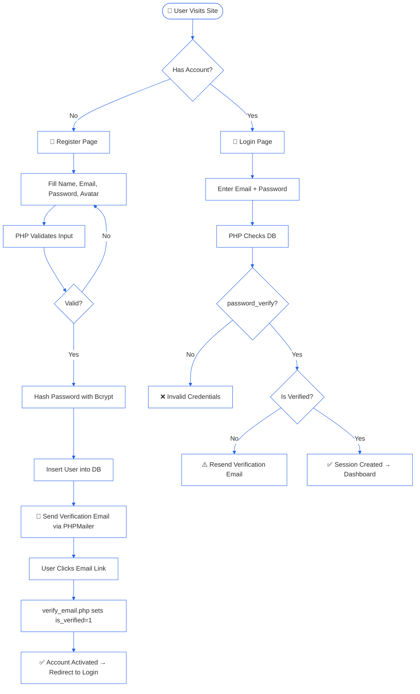
```mermaid
%%{init: {
  'theme': 'default',
  'themeVariables': {
    'darkMode': false,
    'background': '#ffffff',
    'mainBkg': '#ffffff',
    'nodeBorder': '#2563eb',
    'primaryColor': '#ffffff',
    'primaryTextColor': '#0f172a',
    'primaryBorderColor': '#2563eb',
    'lineColor': '#2563eb',
    'clusterBkg': '#f8fafc',
    'clusterBorder': '#94a3b8',
    'edgeLabelBackground': '#ffffff'
  }
}}%%
flowchart TD
    A([👤 User Visits Site]) --> B{Has Account?}
    B -- No --> C[📝 Register Page]
    C --> D[Fill Name, Email, Password, Avatar]
    D --> E[PHP Validates Input]
    E --> F{Valid?}
    F -- No --> D
    F -- Yes --> G[Hash Password with Bcrypt]
    G --> H[Insert User into DB]
    H --> I[📧 Send Verification Email via PHPMailer]
    I --> J[User Clicks Email Link]
    J --> K[verify_email.php sets is_verified=1]
    K --> L[✅ Account Activated → Redirect to Login]
    B -- Yes --> M[🔑 Login Page]
    M --> N[Enter Email + Password]
    N --> O[PHP Checks DB]
    O --> P{password_verify?}
    P -- No --> Q[❌ Invalid Credentials]
    P -- Yes --> R{Is Verified?}
    R -- No --> S[⚠️ Resend Verification Email]
    R -- Yes --> T[✅ Session Created → Dashboard]
```

### 📘 Course Creation & File Upload

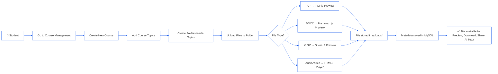
```mermaid
%%{init: {
  'theme': 'default',
  'themeVariables': {
    'darkMode': false,
    'background': '#ffffff',
    'mainBkg': '#ffffff',
    'nodeBorder': '#2563eb',
    'primaryColor': '#ffffff',
    'primaryTextColor': '#0f172a',
    'primaryBorderColor': '#2563eb',
    'lineColor': '#2563eb',
    'clusterBkg': '#f8fafc',
    'clusterBorder': '#94a3b8',
    'edgeLabelBackground': '#ffffff'
  }
}}%%
flowchart LR
    A[👤 Student] --> B[Go to Course Management]
    B --> C[Create New Course]
    C --> D[Add Course Topics]
    D --> E[Create Folders inside Topics]
    E --> F[Upload Files to Folder]
    F --> G{File Type?}
    G --> H[PDF → PDF.js Preview]
    G --> I[DOCX → Mammoth.js Preview]
    G --> J[XLSX → SheetJS Preview]
    G --> K[Audio/Video → HTML5 Player]
    H & I & J & K --> L[File stored in uploads/]
    L --> M[Metadata saved in MySQL]
    M --> N[✅ File available for Preview, Download, Share, AI Tutor]
```

### 🏫 Google Classroom Sync

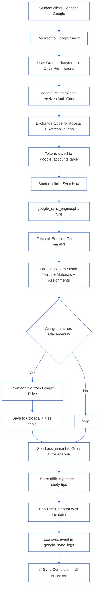
```mermaid
%%{init: {
  'theme': 'default',
  'themeVariables': {
    'darkMode': false,
    'background': '#ffffff',
    'mainBkg': '#ffffff',
    'nodeBorder': '#2563eb',
    'primaryColor': '#ffffff',
    'primaryTextColor': '#0f172a',
    'primaryBorderColor': '#2563eb',
    'lineColor': '#2563eb',
    'clusterBkg': '#f8fafc',
    'clusterBorder': '#94a3b8',
    'edgeLabelBackground': '#ffffff'
  }
}}%%
flowchart TD
    A[Student clicks Connect Google] --> B[Redirect to Google OAuth]
    B --> C[User Grants Classroom + Drive Permissions]
    C --> D[google_callback.php receives Auth Code]
    D --> E[Exchange Code for Access + Refresh Tokens]
    E --> F[Tokens saved to google_accounts table]
    F --> G[Student clicks Sync Now]
    G --> H[google_sync_engine.php runs]
    H --> I[Fetch all Enrolled Courses via API]
    I --> J[For each Course fetch Topics + Materials + Assignments]
    J --> K{Assignment has attachments?}
    K -- Yes --> L[Download file from Google Drive]
    L --> M[Save to uploads/ + files table]
    K -- No --> N[Skip]
    M & N --> O[Send assignment to Groq AI for analysis]
    O --> P[Store difficulty score + study tips]
    P --> Q[Populate Calendar with due dates]
    Q --> R[Log sync event in google_sync_logs]
    R --> S[✅ Sync Complete — UI refreshes]
```

## 📸 Screenshots

> 🌐 **Live Application:** [notenest-ai.ct.ws](https://notenest-ai.ct.ws/login.php) — Live screenshots captured from the deployed system.

---

### 📊 Dashboard — Overview
> **Live:** [notenest-ai.ct.ws/dashboard.php](https://notenest-ai.ct.ws/dashboard.php)

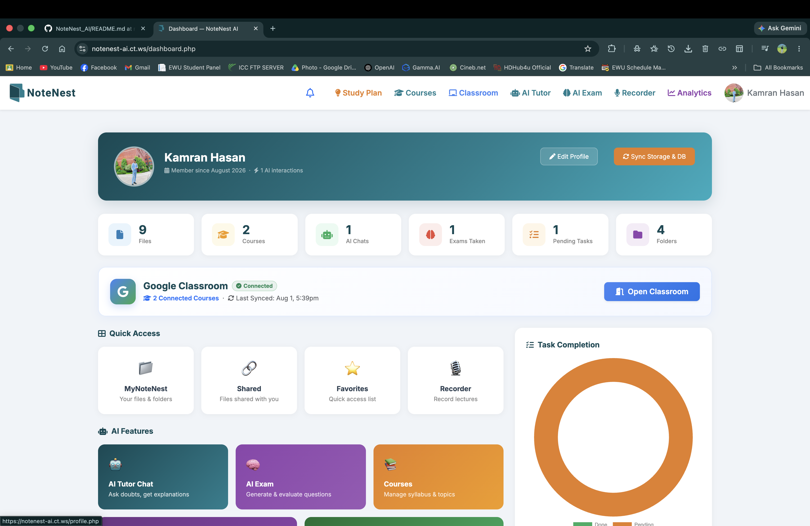

---

### 📊 Dashboard — Activity & Recent Scores
> **Live:** [notenest-ai.ct.ws/dashboard.php](https://notenest-ai.ct.ws/dashboard.php)

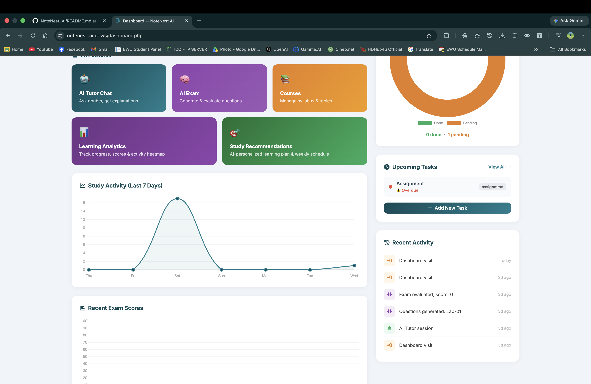

---

### 📘 Course Management
> **Live:** [notenest-ai.ct.ws/course_management.php](https://notenest-ai.ct.ws/course_management.php)

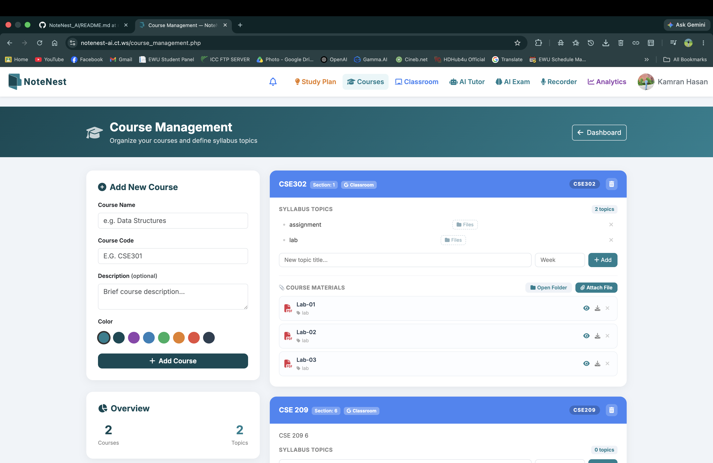

---

### 🏫 Google Classroom Integration
> **Live:** [notenest-ai.ct.ws/google_classroom.php](https://notenest-ai.ct.ws/google_classroom.php)

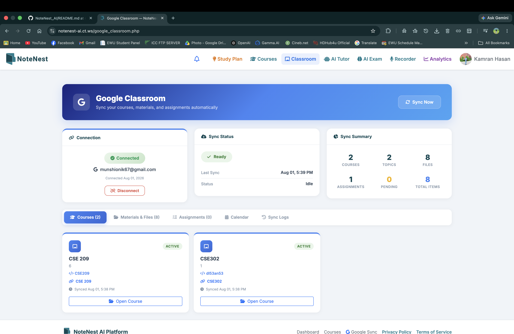

---

### 🤖 AI Tutor
> **Live:** [notenest-ai.ct.ws/ai_tutor.php](https://notenest-ai.ct.ws/ai_tutor.php)

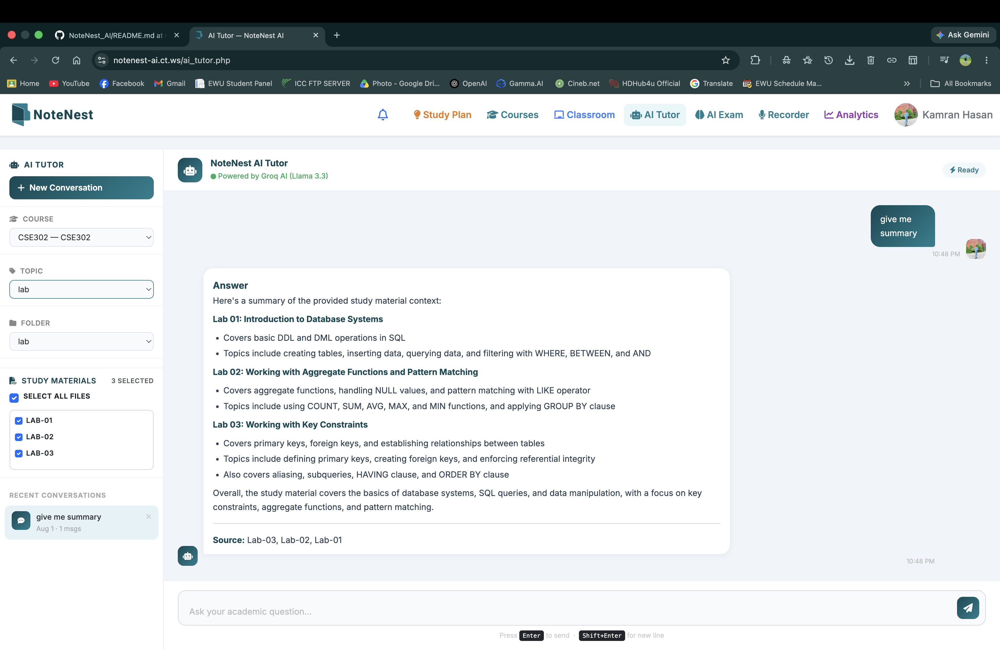

---

### 📝 AI Exam Practice & Generation
> **Live:** [notenest-ai.ct.ws/ai_exam.php](https://notenest-ai.ct.ws/ai_exam.php)

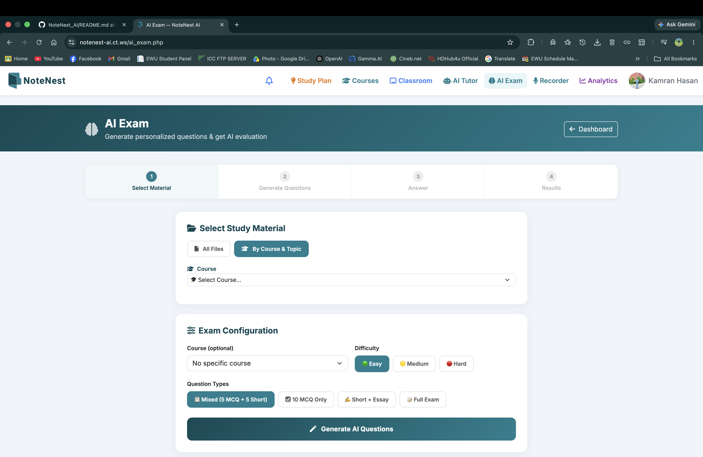

---

### 📈 Learning & Progress Analytics
> **Live:** [notenest-ai.ct.ws/progress_analytics.php](https://notenest-ai.ct.ws/progress_analytics.php)

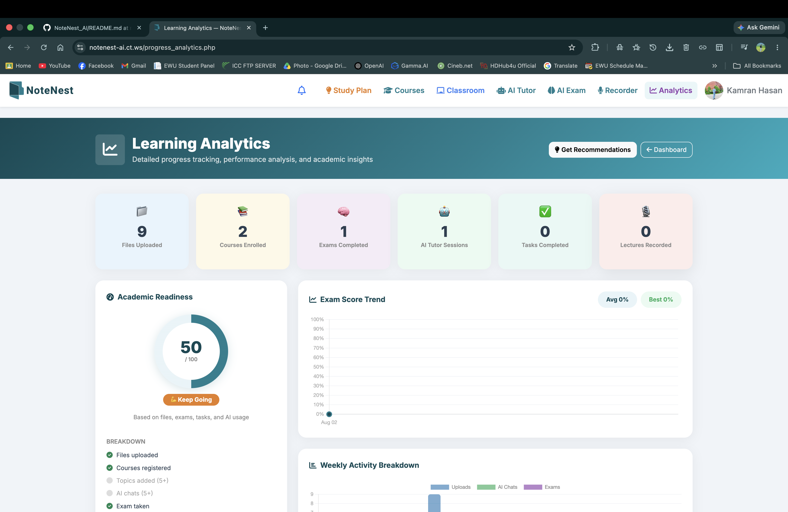

---

### 🎙️ Lecture Recorder
> **Live:** [notenest-ai.ct.ws/lecture_recorder.php](https://notenest-ai.ct.ws/lecture_recorder.php)

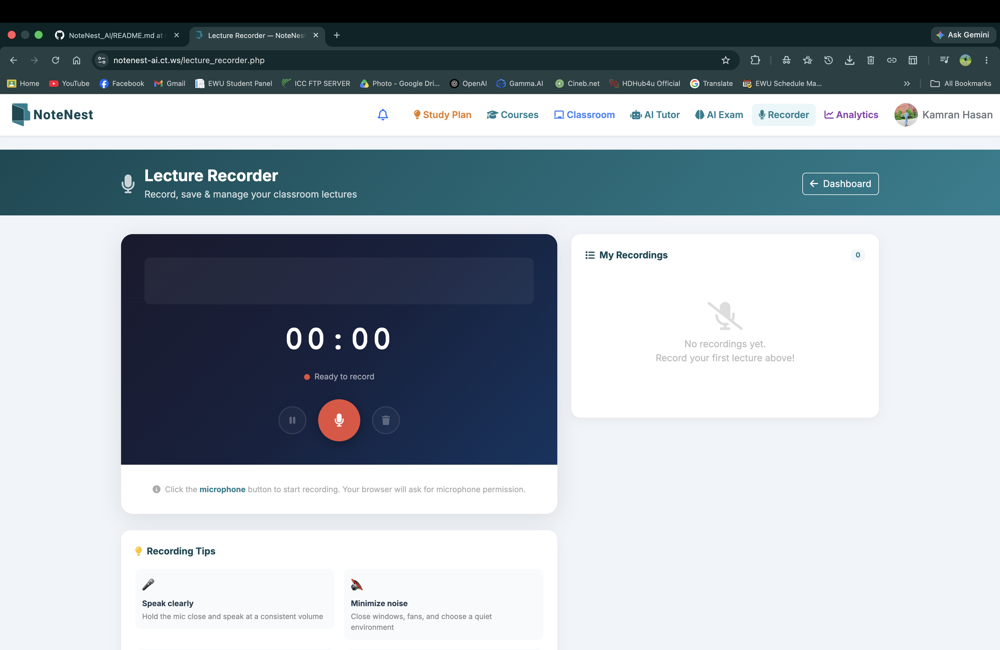

---

### 💡 Adaptive Study Recommendations
> **Live:** [notenest-ai.ct.ws/study_recommendations.php](https://notenest-ai.ct.ws/study_recommendations.php)

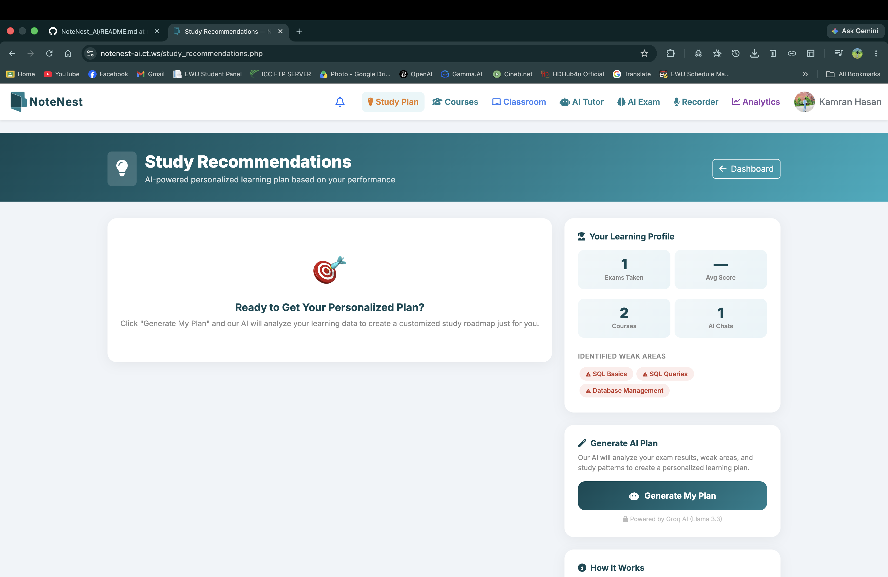

---

### 📁 My NoteNest (File Manager)
> **Live:** [notenest-ai.ct.ws/my_note_nest.php](https://notenest-ai.ct.ws/my_note_nest.php)

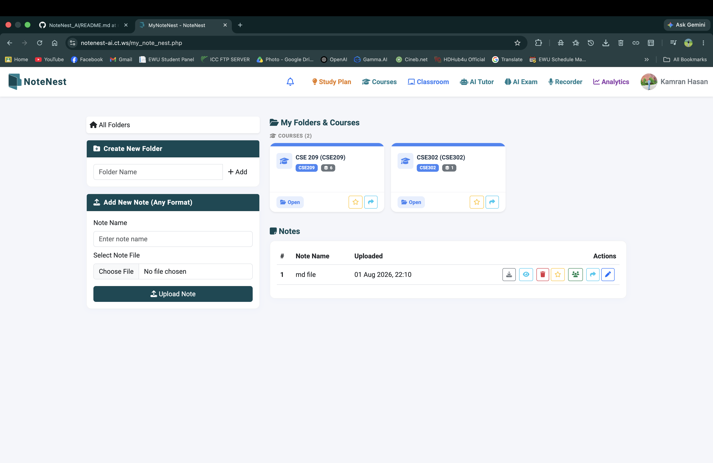

---

### 🤝 Shared NoteNest
> **Live:** [notenest-ai.ct.ws/shared_note_nest.php](https://notenest-ai.ct.ws/shared_note_nest.php)

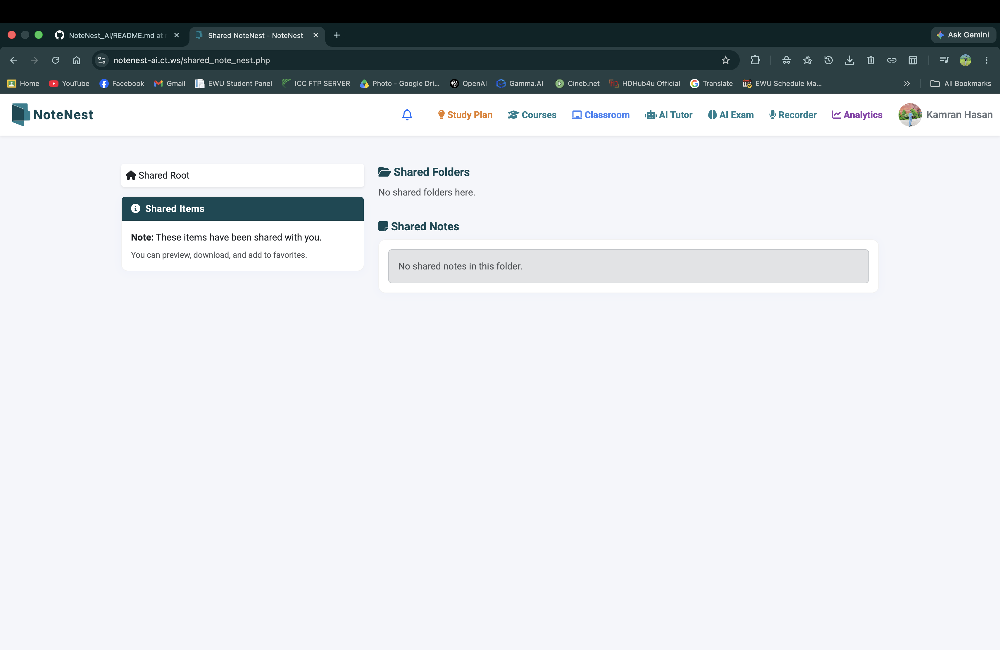

---

### ⭐ My Favorites
> **Live:** [notenest-ai.ct.ws/favorites.php](https://notenest-ai.ct.ws/favorites.php)

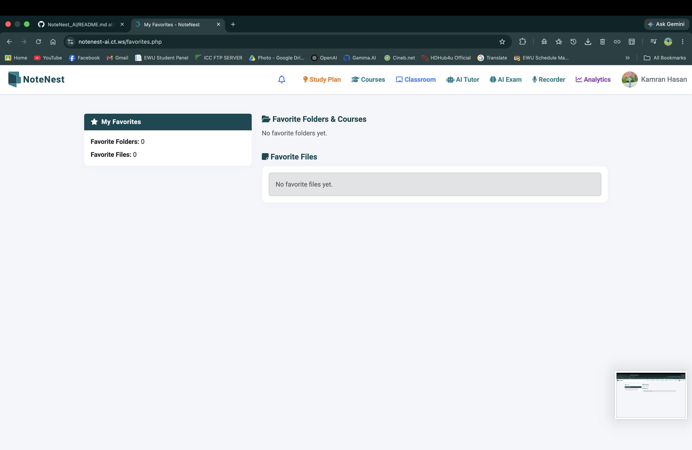

---

### 👤 Profile & Account Settings
> **Live:** [notenest-ai.ct.ws/profile.php](https://notenest-ai.ct.ws/profile.php)

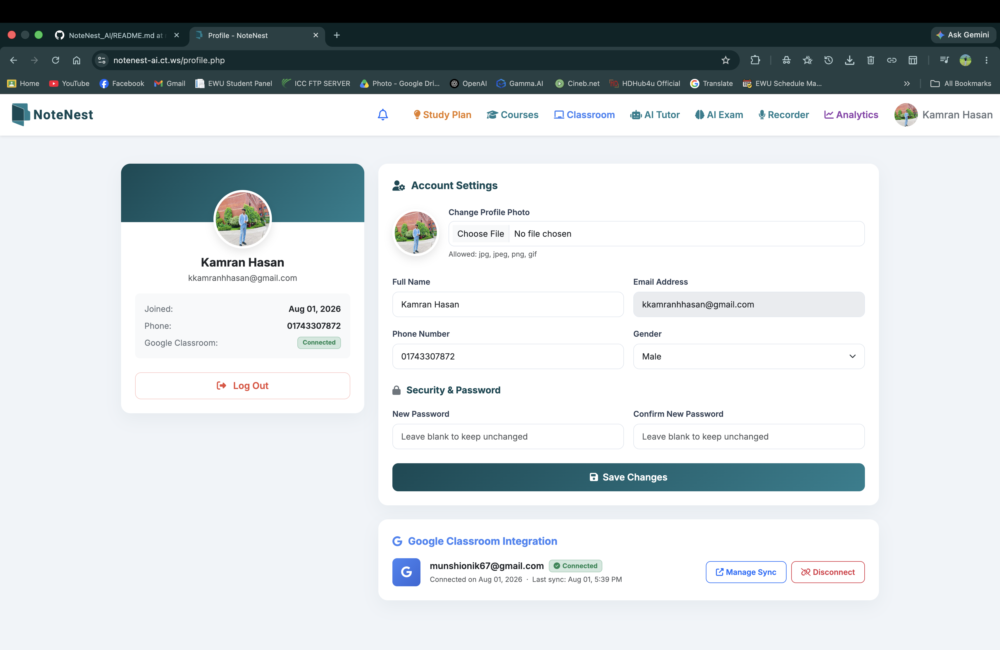

---

## 🚀 Installation & Setup

### ✅ Prerequisites

| Requirement | Version | Notes |
|---|---|---|
| XAMPP / WAMP / MAMP | PHP 8.0+ | Web server with MySQL |
| Python | 3.9+ | Required for ChromaDB RAG service |
| Google Cloud Project | — | For Classroom API + OAuth 2.0 |
| Groq API Key | — | Free at [console.groq.com](https://console.groq.com) |
| Gmail App Password | — | For PHPMailer email delivery |

---

### Step 1 — Clone the Repository

```bash
git clone https://github.com/kkamranhasan/NoteNest.git
cd NoteNest-main
```

---

### Step 2 — Place in Web Server Root

| Platform | Path |
|---|---|
| XAMPP macOS | `/Applications/XAMPP/xamppfiles/htdocs/NoteNest-main/` |
| XAMPP Windows | `C:\xampp\htdocs\NoteNest-main\` |
| WAMP | `C:\wamp64\www\NoteNest-main\` |

---

### Step 3 — Database Setup

1. Open **phpMyAdmin** at `http://localhost/phpmyadmin`
2. Create a new database named **`notenest`**
3. Import the schema:

```bash
mysql -u root -p notenest < database.sql
mysql -u root -p notenest < migration_add_missing_tables.sql
```

Or use phpMyAdmin's **Import** tab and upload `database.sql`.

---

### Step 4 — Configure Environment

```bash
cp config.example.php config.php
```

Open `config.php` and fill in your credentials:

```php
// ── Database ───────────────────────────────
define('DB_SERVER',   'localhost');
define('DB_USERNAME', 'root');
define('DB_PASSWORD', '');             // Your MySQL password
define('DB_NAME',     'notenest');

// ── Groq AI ────────────────────────────────
define('GROQ_API_KEY', 'gsk_your_groq_api_key_here');
define('GROQ_MODEL',   'llama-3.3-70b-versatile');

// ── Gmail SMTP ─────────────────────────────
define('MAIL_USERNAME', 'your_email@gmail.com');
define('MAIL_PASSWORD', 'your_16char_app_password');

// ── Google OAuth 2.0 ───────────────────────
define('GOOGLE_CLIENT_ID',     'your_client_id.apps.googleusercontent.com');
define('GOOGLE_CLIENT_SECRET', 'your_client_secret');
```

---

### Step 5 — Google Cloud Console Setup

1. Go to [Google Cloud Console](https://console.cloud.google.com/) and create a new project
2. Enable these APIs under **APIs & Services → Library**:
   - ✅ Google Classroom API
   - ✅ Google Drive API
3. Configure **OAuth Consent Screen** (User type: External)
4. Create **OAuth 2.0 Credentials** → Web Application
5. Add **Authorized Redirect URI**: `http://localhost/NoteNest-main/google_callback.php`
6. Copy **Client ID** and **Client Secret** into `config.php`

---

### Step 6 — Set Folder Permissions

```bash
mkdir -p uploads/notes uploads/recordings img/user_photos
chmod -R 777 uploads img/user_photos
```

---

### Step 7 — Start ChromaDB Vector Service (Optional — for RAG)

```bash
# Create Python virtual environment
python3 -m venv .venv
./.venv/bin/pip install chromadb fastapi uvicorn pydantic

# Start on port 8000
./.venv/bin/python chroma_service.py
```

---

### Step 8 — Setup Cron Jobs (Optional — for automation)

```bash
# Edit crontab
crontab -e

# Add these jobs:
0 * * * *   /usr/bin/php /path/to/NoteNest-main/cron/todo_reminder.php    > /dev/null 2>&1
0 */6 * * * /usr/bin/php /path/to/NoteNest-main/cron/google_sync.php      > /dev/null 2>&1
0 8 * * *   /usr/bin/php /path/to/NoteNest-main/cron/google_reminders.php  > /dev/null 2>&1
```

---

### Step 9 — Docker Quick Start (Alternative)

```bash
docker-compose up --build -d
```

Access at: `http://localhost:8080/login.php`

---

### Step 10 — Launch the App 🚀

1. Start **Apache** and **MySQL** in XAMPP Control Panel
2. Open your browser: `http://localhost/NoteNest-main/login.php`
3. Register a new account and verify your email
4. Start learning! 🎓

---

## 🌐 InfinityFree Deployment Guide (Free Hosting)

> ☁️ Deploy NoteNest AI online for **free** using [InfinityFree](https://infinityfree.net/) — no credit card required.

### ⚠️ InfinityFree Limitations to Note

| Limitation | Detail |
|---|---|
| ❌ No SSH / Terminal | File management via File Manager or FTP only |
| ❌ No Cron Jobs (free tier) | Automated background sync not available |
| ❌ No Python / ChromaDB | RAG vector search feature disabled |
| ✅ PHP 8.x supported | Full PHP backend works |
| ✅ MySQL supported | Full database works via phpMyAdmin |
| ✅ Free subdomain | e.g. `yoursite.infinityfreeapp.com` |
| ✅ 5 GB disk space | Sufficient for note storage |

---

### Step 1 — Create a Free InfinityFree Account

1. Go to [infinityfree.net](https://infinityfree.net/) and click **Register**
2. Verify your email and log in to the dashboard
3. Click **Create Account** → Choose a free subdomain (e.g. `notenest`)
4. Note your **FTP credentials** (hostname, username, password) shown after account creation

---

### Step 2 — Create the MySQL Database

1. In your InfinityFree control panel, go to **MySQL Databases**
2. Click **Create Database** — note the auto-generated:
   - 📌 Database name (e.g. `epiz_12345678_notenest`)
   - 📌 Database username
   - 📌 Database password
   - 📌 MySQL hostname (e.g. `sql123.infinityfree.com`)
3. Click **phpMyAdmin** → select your database → click **Import**
4. Upload `database.sql` → click **Go**
5. Repeat for `migration_add_missing_tables.sql`

---

### Step 3 — Configure config.php for InfinityFree

Update your `config.php` with InfinityFree database credentials:

```php
// ── Database (InfinityFree values) ─────────────────────────
define('DB_SERVER',   'sql123.infinityfree.com');  // Your MySQL hostname
define('DB_USERNAME', 'epiz_12345678');             // Your DB username
define('DB_PASSWORD', 'your_db_password');          // Your DB password
define('DB_NAME',     'epiz_12345678_notenest');    // Your DB name

// ── App URL ────────────────────────────────────────────────
define('APP_URL', 'https://notenest.infinityfreeapp.com');

// ── Groq AI ────────────────────────────────────────────────
define('GROQ_API_KEY', 'gsk_your_groq_api_key_here');
define('GROQ_MODEL',   'llama-3.3-70b-versatile');

// ── Gmail SMTP ─────────────────────────────────────────────
define('MAIL_USERNAME', 'your_email@gmail.com');
define('MAIL_PASSWORD', 'your_16char_app_password');

// ── Google OAuth 2.0 ───────────────────────────────────────
define('GOOGLE_CLIENT_ID',     'your_client_id.apps.googleusercontent.com');
define('GOOGLE_CLIENT_SECRET', 'your_client_secret');
```

> ⚠️ Also update your Google Cloud Console redirect URI to:
> `https://notenest.infinityfreeapp.com/google_callback.php`

---

### Step 4 — Upload Files via FTP

**Option A — FileZilla (Recommended)**

1. Download [FileZilla](https://filezilla-project.org/) (free)
2. Open FileZilla → File → Site Manager → New Site
3. Enter your InfinityFree FTP credentials:
   ```
   Host:     ftpupload.net
   Port:     21
   Protocol: FTP
   User:     epiz_12345678
   Password: your_ftp_password
   ```
4. Connect and navigate to `htdocs/` on the remote side
5. Drag and drop all project files (except `vendor/`, `node_modules/`, `.git/`)

**Option B — InfinityFree Online File Manager**

1. In the control panel go to **Files → Online File Manager**
2. Navigate to `htdocs/`
3. Create a folder `NoteNest` and upload files one-by-one or as a ZIP
4. If uploading as ZIP: upload → right-click → **Extract**

---

### Step 5 — Upload Vendor Dependencies

Since InfinityFree has no Composer, install locally first and upload:

```bash
# Run locally before uploading
composer install --no-dev --optimize-autoloader
```

Then upload the entire `vendor/` folder via FTP.

---

### Step 6 — Set Correct File Permissions

In the **File Manager**, right-click the following folders and set permissions to **755**:

```
htdocs/NoteNest/uploads/        → 755
htdocs/NoteNest/uploads/notes/  → 755
htdocs/NoteNest/img/            → 755
```

> ℹ️ InfinityFree uses `755` (not `777`) for write permissions.

---

### Step 7 — Configure .htaccess

Ensure the project root `.htaccess` exists. If you encounter 500 errors, simplify it:

```apache
Options -Indexes
DirectoryIndex index.php login.php

<IfModule mod_rewrite.c>
    RewriteEngine On
    RewriteBase /
</IfModule>
```

---

### Step 8 — Test the Deployment

1. Visit `https://yoursite.infinityfreeapp.com/login.php`
2. Register a new account
3. Verify email (ensure Gmail SMTP credentials are correct)
4. Test file upload, course creation, and AI Tutor

### 🚀 InfinityFree Deployment Checklist

```
☐ InfinityFree account created
☐ MySQL database created and credentials noted
☐ database.sql imported via phpMyAdmin
☐ migration_add_missing_tables.sql imported
☐ config.php updated with InfinityFree DB credentials
☐ config.php APP_URL updated to InfinityFree subdomain
☐ Google OAuth redirect URI updated in Google Cloud Console
☐ All PHP files uploaded via FTP (except .git, node_modules)
☐ vendor/ folder uploaded
☐ uploads/ and img/ folder permissions set to 755
☐ .htaccess is present and correct
☐ Login page loads at https://yoursite.infinityfreeapp.com/login.php
```

---

## 📂 Project Structure

```
NoteNest-main/
│
├── 📄 index.php                        — Entry point redirect
├── 📄 login.php                        — User login page
├── 📄 register.php                     — Registration + avatar upload
├── 📄 verify_email.php                 — Email verification handler
├── 📄 logout.php                       — Session destroy
│
├── 📄 dashboard.php                    — Main dashboard (stats, overview)
├── 📄 course_management.php            — Course, topic, folder, file manager
├── 📄 my_note_nest.php                 — Personal file & folder explorer
├── 📄 shared_note_nest.php             — Shared-with-me view
├── 📄 favorites.php                    — Starred items
│
├── 📄 google_classroom.php             — GC hub (courses, assignments, calendar)
├── 📄 google_auth.php                  — OAuth redirect initiator
├── 📄 google_callback.php              — OAuth token exchange handler
├── 📄 google_disconnect.php            — Disconnect Google account
├── 📄 dashboard_gc_ajax.php            — AJAX drill-down endpoint
│
├── 📄 ai_tutor.php                     — Groq-powered AI academic tutor
├── 📄 ai_exam.php                      — AI exam generation & grading
├── 📄 generate_exam.php                — Exam question generator API
├── 📄 generate_answer.php              — Answer evaluation API
├── 📄 study_recommendations.php        — AI study plan generator
│
├── 📄 progress_analytics.php           — Analytics (heatmaps, charts)
├── 📄 lecture_recorder.php             — Audio recorder + waveform
├── 📄 todo.php                         — Task manager
├── 📄 notifications.php                — Notification center
├── 📄 profile.php                      — User profile editor
│
├── 📄 config.php                       — App configuration (gitignored)
├── 📄 config.example.php               — Configuration template
├── 📄 database.sql                     — Main database schema
├── 📄 chroma_service.py                — Python FastAPI ChromaDB service
├── 📄 Dockerfile                       — Docker image definition
├── 📄 docker-compose.yml               — Multi-container orchestration
│
├── 📁 includes/                        — Core backend modules
│   ├── auth.php                        — Session guard
│   ├── db.php                          — DB connection
│   ├── navbar.php                      — Navigation bar
│   ├── footer.php                      — Page footer
│   ├── functions.php                   — Utility functions
│   ├── ai_service.php                  — Groq API wrapper
│   ├── google_classroom_service.php    — GC + Drive API client
│   ├── google_sync_engine.php          — Background sync engine
│   ├── google_ai_analyzer.php          — AI assignment analyzer
│   ├── google_reminder_engine.php      — Notification & reminder engine
│   └── send_email.php                  — PHPMailer SMTP helper
│
├── 📁 css/                             — Modular per-page stylesheets
├── 📁 cron/                            — Scheduled background tasks
├── 📁 uploads/                         — User file storage
│   ├── notes/                          — Uploaded documents
│   └── recordings/                     — Lecture audio recordings
├── 📁 img/                             — Static images & user avatars
├── 📁 phpmailer/                       — Email delivery library
├── 📁 vendor/                          — Composer dependencies
└── 📁 embeddings/                      — Vector embedding cache
```


## 🔒 Security Measures

| Measure | Implementation |
|---|---|
| 🛡️ SQL Injection Prevention | 100% MySQLi prepared statements with bound parameters |
| 🔐 Password Security | `password_hash()` + `password_verify()` — Bcrypt algorithm |
| 🚪 Route Protection | Session guard `auth.php` on every internal page |
| 🔑 OAuth Token Security | Tokens stored per user with auto-refresh handling |
| 🧹 XSS Prevention | `htmlspecialchars()` on all rendered user data |
| 🔒 File Access Control | Strict ownership & permission checks before download |
| 📧 Email Verification | Token-based verification before account activation |
| 🔄 CSRF Awareness | Session-based action validation on sensitive operations |

---

## 🔮 Future Improvements

| Priority | Feature | Description |
|---|---|---|
| 🔥 High | 📱 Mobile App | Native Android/iOS app using React Native or Flutter |
| 🔥 High | 🔊 Voice Assistant | Voice-activated AI tutor using Web Speech API |
| 🟡 Medium | 🔤 OCR Support | Extract text from scanned PDFs and handwritten notes |
| 🟡 Medium | 👥 Real-time Collaboration | Live shared editing of notes using WebSockets |
| 🟡 Medium | 📡 Offline Mode | Progressive Web App (PWA) with offline note access |
| 🟢 Low | 🌐 Multi-language Support | i18n support for non-English speaking students |
| 🟢 Low | 🎯 Adaptive Learning | ML-based personalized quiz difficulty adjustment |
| 🟢 Low | 📊 Advanced Analytics | Predictive study performance modeling |
| 🟢 Low | 🔗 LMS Integrations | Moodle, Canvas, Microsoft Teams integrations |

---

## 📊 Project Stats

<div align="center">

| Metric | Value |
|---|---|
| 🧩 Total Modules | 11+ |
| 🗄️ Database Tables | **26** |
| 📄 PHP Files | 50+ |
| 🤖 AI Model | Llama 3.3 70B (Groq) |
| 🔗 External APIs | 3 (Groq, Google Classroom, Google Drive) |
| ☁️ Free Hosting | InfinityFree (PHP + MySQL) |
| 🎓 Project Type | Academic Project |

</div>

---

<div align="center">

---

### 🙏 Acknowledgements

We thank the **Department of Computer Science & Engineering** for their guidance and support.
Special thanks to [Groq](https://groq.com) for providing lightning-fast AI inference,
and [Google](https://developers.google.com/classroom) for the Classroom API.

---

<br/>

**Built with ❤️ by Team NoteNest**

<br/>
<br/>

```
 ███╗   ██╗ ██████╗ ████████╗███████╗███╗   ██╗███████╗███████╗████████╗
 ████╗  ██║██╔═══██╗╚══██╔══╝██╔════╝████╗  ██║██╔════╝██╔════╝╚══██╔══╝
 ██╔██╗ ██║██║   ██║   ██║   █████╗  ██╔██╗ ██║█████╗  ███████╗   ██║
 ██║╚██╗██║██║   ██║   ██║   ██╔══╝  ██║╚██╗██║██╔══╝  ╚════██║   ██║
 ██║ ╚████║╚██████╔╝   ██║   ███████╗██║ ╚████║███████╗███████║   ██║
 ╚═╝  ╚═══╝ ╚═════╝    ╚═╝   ╚══════╝╚═╝  ╚═══╝╚══════╝╚══════╝   ╚═╝
                  An AI-Powered Academic Resource Management Platform
```

*NoteNest — Organize smarter. Study deeper. Excel further.* 🧠

</div>
