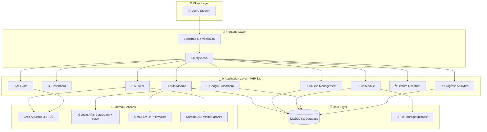
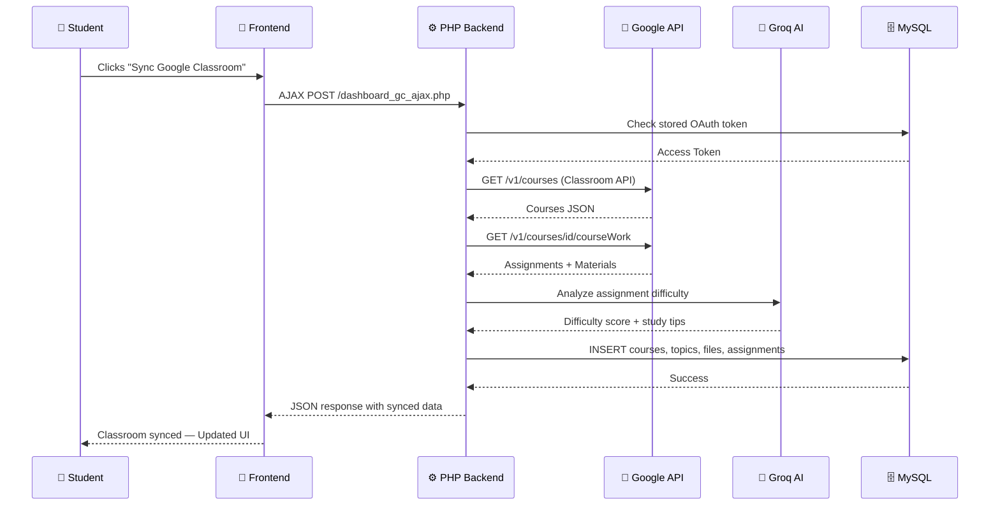
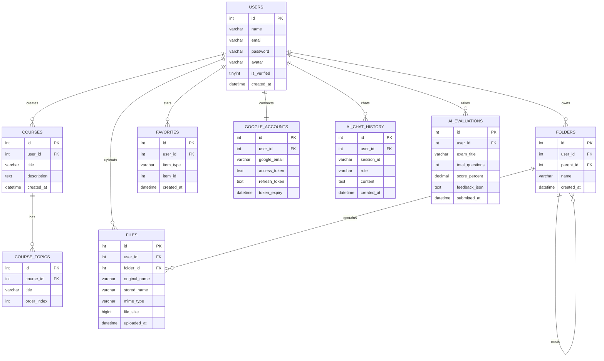
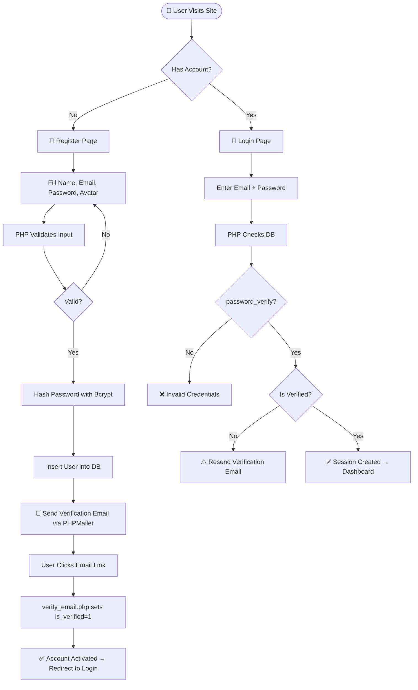
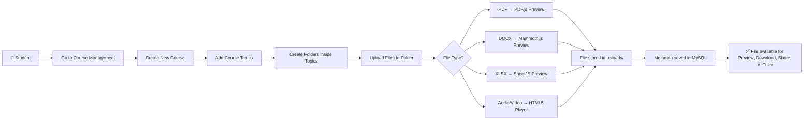
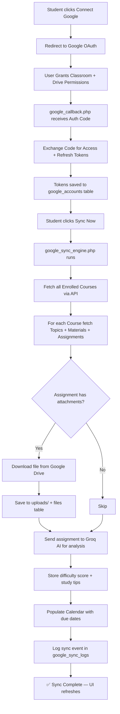
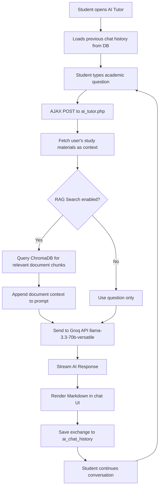
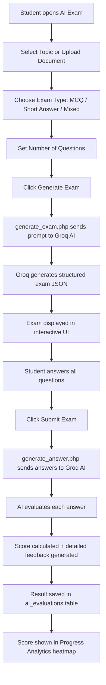

<div align="center">


# 🧠 NoteNest AI

### *Your Intelligent Academic Companion*

> **An all-in-one AI-powered academic resource management platform that transforms the way students learn, organize, and excel.**

<br/>

[](https://php.net)
[](https://mysql.com)
[](https://getbootstrap.com)
[](https://developer.mozilla.org/en-US/docs/Web/JavaScript)
[](https://groq.com)
[](https://developers.google.com/classroom)
[](LICENSE)
[]()

<br/>

[📸 Screenshots](#-screenshots) · [🚀 Quick Start](#-installation--setup) · [✨ Features](#-features) · [🏗 Architecture](#️-system-architecture) · [🎬 Demo](#-demo-video)

---

</div>

## 📖 Project Overview

**NoteNest AI** was born from a real frustration: students today juggle multiple platforms — Google Classroom for coursework, cloud drives for files, separate apps for notes, and ChatGPT for studying — creating a fragmented, inefficient learning experience.

### 🎯 The Problem

| Pain Point | Common Student Experience |
|---|---|
| 📂 Disorganized notes | Files scattered across drives, devices, and apps |
| 🔄 Manual syncing | Manually downloading course materials from Google Classroom |
| 📚 Passive studying | No personalized AI guidance or adaptive exam preparation |
| 📊 No progress insight | Unable to track learning patterns and weak areas |
| 🎙️ Lost lecture content | No easy way to record and store lectures alongside notes |

### 💡 The Solution

**NoteNest AI** unifies everything into a single, intelligent platform — course management, Google Classroom sync, AI tutoring, AI exam generation, lecture recording, and progress analytics — all powered by Groq's Llama 3.3 70B model.

### 👥 Target Users

- 🎓 **University & college students** managing academic workload
- 📚 **Self-learners** building structured study materials
- 🏫 **Study groups** sharing and collaborating on notes
- 📝 **Final year students** needing AI-powered exam preparation

---

## ✨ Features

### 🔐 Authentication & User Management

| Feature | Description |
|---|---|
| Secure Registration | Email/password registration with avatar upload |
| Email Verification | OTP-style email verification via Gmail SMTP + PHPMailer |
| Session Protection | Route guards on all internal pages via `auth.php` |
| Password Hashing | Bcrypt (`password_hash()`) for secure credential storage |
| Profile Management | Update name, avatar, and change password |

### 📘 Course & Academic Management

| Feature | Description |
|---|---|
| Course Creation | Create and manage custom courses with descriptions |
| Topic Management | Hierarchical topic structure within each course |
| Folder System | Unlimited nested folders for organized file storage |
| File Upload | Upload PDF, DOCX, XLSX, images, audio, video, code files |
| File Preview | In-browser preview using PDF.js, Mammoth.js, SheetJS |
| One-Click Download | Instantly download individual files or folder contents |

### 🏫 Google Classroom Integration

| Feature | Description |
|---|---|
| Google OAuth 2.0 | Secure account connection with Classroom & Drive scopes |
| Course & Topic Sync | Auto-import enrolled courses, topics & syllabus structure |
| Material Download | Download attachments directly into NoteNest storage |
| Assignment Sync | Import assignment titles, due dates into To-Do & Calendar |
| AJAX Drill-Down | Browse Courses → Topics → Files without page reloads |
| AI Assignment Analysis | Groq AI scores difficulty, estimates hours, gives study tips |
| Interactive Calendar | Visual monthly calendar auto-populated with deadlines |
| Background Sync | Cron jobs keep materials fresh & send assignment reminders |

### 🤖 AI-Powered Features

| Feature | Description |
|---|---|
| AI Tutor Chat | Ask any academic question, get Markdown-formatted answers |
| Persistent Chat History | All AI conversations saved and resumable per session |
| AI Exam Wizard | Upload notes → AI generates customized MCQ & Short Answer exams |
| AI Answer Evaluation | Submit exam answers → AI scores, evaluates, gives feedback |
| Study Recommendations | AI-personalized learning plans and weekly study schedules |
| Semantic Search (RAG) | Python ChromaDB microservice for document semantic search |

### ⭐ Productivity & Collaboration

| Feature | Description |
|---|---|
| Favorites | Star important files and folders for quick access |
| Lecture Recorder | In-browser audio recorder with real-time waveform visualization |
| To-Do Manager | Task checklist with priority tags (High/Medium/Low) and due dates |
| File Sharing | Share files and folders with classmates via email |
| Recursive Access | Sharing a folder grants view-only access to all sub-items |
| Notifications | System notification center for reminders and alerts |

### 📊 Analytics & Insights

| Feature | Description |
|---|---|
| Progress Analytics | Activity heatmaps, exam score bar charts (Chart.js) |
| AI Learning Insights | Personalized feedback on study habits and weak topics |
| Storage Tracking | Real-time storage usage sync |
| Sync Audit Logs | Full audit trail of all Google Classroom sync events |

---

## 🛠️ Technology Stack

<div align="center">

| Layer | Technology | Purpose |
|---|---|---|
| 🖥️ **Backend** | PHP 8.x | Core server-side logic, routing, API calls |
| 🗄️ **Database** | MySQL 8.x | Relational data storage with prepared statements |
| 🎨 **Frontend** | Bootstrap 5.3 + Vanilla JS + jQuery | Responsive UI, AJAX interactions |
| 🤖 **AI Engine** | Groq API — `llama-3.3-70b-versatile` | Tutoring, exam generation, analysis |
| 🔍 **Vector Search** | ChromaDB + Python FastAPI | Semantic RAG document search |
| 🔗 **Integrations** | Google Classroom API + Drive API (OAuth 2.0) | Course and material sync |
| 📧 **Email** | PHPMailer + Gmail SMTP | Verification emails and reminders |
| 📄 **Doc Parsing** | Mammoth.js · SheetJS · PDF.js | In-browser document preview |
| 📈 **Charts** | Chart.js | Analytics visualizations |
| 🐳 **DevOps** | Docker + Docker Compose | Containerized deployment |

</div>

---

## 🏗️ System Architecture

### High-Level Architecture



### 🔄 Request Flow — Google Classroom Sync



---

## 🗄️ Database Design

### Entity Relationship Diagram



### Database Schema Summary

| Table | Description |
|---|---|
| `users` | Credentials, avatar, verification status |
| `courses` | Manual course records per user |
| `course_topics` | Syllabus sections within courses |
| `folders` | Hierarchical folder tree |
| `files` | Uploaded document metadata & paths |
| `favorites` | Starred files and folders |
| `shared_access` | File/folder permission grants |
| `google_accounts` | Google OAuth tokens per user |
| `google_courses` | Synced Google Classroom courses |
| `google_topics` | Classroom topic modules |
| `google_files` | Classroom attachments |
| `google_assignments` | Coursework + AI analysis data |
| `google_sync_logs` | Audit trail of sync events |
| `todos` | User tasks with priorities |
| `ai_chat_history` | AI Tutor conversation logs |
| `ai_evaluations` | Exam scores and AI feedback |
| `user_progress` | Activity log for heatmaps |

---

## 🔄 Workflow Diagrams

### 🔐 Authentication Flow



### 📘 Course Creation & File Upload



### 🏫 Google Classroom Sync



### 🤖 AI Tutor Flow



### 📝 AI Exam Flow



---

## 📸 Screenshots

> 📌 Add screenshots to a `screenshots/` folder in the project root to populate this section.

### 🔐 Login Page


### 📊 Dashboard


### 📘 Course Management


### 🏫 Google Classroom Integration


### 🤖 AI Tutor


### 📝 AI Exam


### 📈 Progress Analytics


### 🎙️ Lecture Recorder


> 💡 **Tip:** Take screenshots of each page in your browser, save them in `screenshots/`, and GitHub will render them automatically in this README.

---

## 🚀 Installation & Setup

### ✅ Prerequisites

| Requirement | Version | Notes |
|---|---|---|
| XAMPP / WAMP / MAMP | PHP 8.0+ | Web server with MySQL |
| Python | 3.9+ | Required for ChromaDB RAG service |
| Google Cloud Project | — | For Classroom API + OAuth 2.0 |
| Groq API Key | — | Free at [console.groq.com](https://console.groq.com) |
| Gmail App Password | — | For PHPMailer email delivery |

---

### Step 1 — Clone the Repository

```bash
git clone https://github.com/kkamranhasan/NoteNest.git
cd NoteNest-main
```

---

### Step 2 — Place in Web Server Root

| Platform | Path |
|---|---|
| XAMPP macOS | `/Applications/XAMPP/xamppfiles/htdocs/NoteNest-main/` |
| XAMPP Windows | `C:\xampp\htdocs\NoteNest-main\` |
| WAMP | `C:\wamp64\www\NoteNest-main\` |

---

### Step 3 — Database Setup

1. Open **phpMyAdmin** at `http://localhost/phpmyadmin`
2. Create a new database named **`notenest`**
3. Import the schema:

```bash
mysql -u root -p notenest < database.sql
mysql -u root -p notenest < migration_add_missing_tables.sql
```

Or use phpMyAdmin's **Import** tab and upload `database.sql`.

---

### Step 4 — Configure Environment

```bash
cp config.example.php config.php
```

Open `config.php` and fill in your credentials:

```php
// ── Database ───────────────────────────────
define('DB_SERVER',   'localhost');
define('DB_USERNAME', 'root');
define('DB_PASSWORD', '');             // Your MySQL password
define('DB_NAME',     'notenest');

// ── Groq AI ────────────────────────────────
define('GROQ_API_KEY', 'gsk_your_groq_api_key_here');
define('GROQ_MODEL',   'llama-3.3-70b-versatile');

// ── Gmail SMTP ─────────────────────────────
define('MAIL_USERNAME', 'your_email@gmail.com');
define('MAIL_PASSWORD', 'your_16char_app_password');

// ── Google OAuth 2.0 ───────────────────────
define('GOOGLE_CLIENT_ID',     'your_client_id.apps.googleusercontent.com');
define('GOOGLE_CLIENT_SECRET', 'your_client_secret');
```

---

### Step 5 — Google Cloud Console Setup

1. Go to [Google Cloud Console](https://console.cloud.google.com/) and create a new project
2. Enable these APIs under **APIs & Services → Library**:
   - ✅ Google Classroom API
   - ✅ Google Drive API
3. Configure **OAuth Consent Screen** (User type: External)
4. Create **OAuth 2.0 Credentials** → Web Application
5. Add **Authorized Redirect URI**: `http://localhost/NoteNest-main/google_callback.php`
6. Copy **Client ID** and **Client Secret** into `config.php`

---

### Step 6 — Set Folder Permissions

```bash
mkdir -p uploads/notes uploads/recordings img/user_photos
chmod -R 777 uploads img/user_photos
```

---

### Step 7 — Start ChromaDB Vector Service (Optional — for RAG)

```bash
# Create Python virtual environment
python3 -m venv .venv
./.venv/bin/pip install chromadb fastapi uvicorn pydantic

# Start on port 8000
./.venv/bin/python chroma_service.py
```

---

### Step 8 — Setup Cron Jobs (Optional — for automation)

```bash
# Edit crontab
crontab -e

# Add these jobs:
0 * * * *   /usr/bin/php /path/to/NoteNest-main/cron/todo_reminder.php    > /dev/null 2>&1
0 */6 * * * /usr/bin/php /path/to/NoteNest-main/cron/google_sync.php      > /dev/null 2>&1
0 8 * * *   /usr/bin/php /path/to/NoteNest-main/cron/google_reminders.php  > /dev/null 2>&1
```

---

### Step 9 — Docker Quick Start (Alternative)

```bash
docker-compose up --build -d
```

Access at: `http://localhost:8080/login.php`

---

### Step 10 — Launch the App 🚀

1. Start **Apache** and **MySQL** in XAMPP Control Panel
2. Open your browser: `http://localhost/NoteNest-main/login.php`
3. Register a new account and verify your email
4. Start learning! 🎓

---

## 📂 Project Structure

```
NoteNest-main/
│
├── 📄 index.php                        — Entry point redirect
├── 📄 login.php                        — User login page
├── 📄 register.php                     — Registration + avatar upload
├── 📄 verify_email.php                 — Email verification handler
├── 📄 logout.php                       — Session destroy
│
├── 📄 dashboard.php                    — Main dashboard (stats, overview)
├── 📄 course_management.php            — Course, topic, folder, file manager
├── 📄 my_note_nest.php                 — Personal file & folder explorer
├── 📄 shared_note_nest.php             — Shared-with-me view
├── 📄 favorites.php                    — Starred items
│
├── 📄 google_classroom.php             — GC hub (courses, assignments, calendar)
├── 📄 google_auth.php                  — OAuth redirect initiator
├── 📄 google_callback.php              — OAuth token exchange handler
├── 📄 google_disconnect.php            — Disconnect Google account
├── 📄 dashboard_gc_ajax.php            — AJAX drill-down endpoint
│
├── 📄 ai_tutor.php                     — Groq-powered AI academic tutor
├── 📄 ai_exam.php                      — AI exam generation & grading
├── 📄 generate_exam.php                — Exam question generator API
├── 📄 generate_answer.php              — Answer evaluation API
├── 📄 study_recommendations.php        — AI study plan generator
│
├── 📄 progress_analytics.php           — Analytics (heatmaps, charts)
├── 📄 lecture_recorder.php             — Audio recorder + waveform
├── 📄 todo.php                         — Task manager
├── 📄 notifications.php                — Notification center
├── 📄 profile.php                      — User profile editor
│
├── 📄 config.php                       — App configuration (gitignored)
├── 📄 config.example.php               — Configuration template
├── 📄 database.sql                     — Main database schema
├── 📄 chroma_service.py                — Python FastAPI ChromaDB service
├── 📄 Dockerfile                       — Docker image definition
├── 📄 docker-compose.yml               — Multi-container orchestration
│
├── 📁 includes/                        — Core backend modules
│   ├── auth.php                        — Session guard
│   ├── db.php                          — DB connection
│   ├── navbar.php                      — Navigation bar
│   ├── footer.php                      — Page footer
│   ├── functions.php                   — Utility functions
│   ├── ai_service.php                  — Groq API wrapper
│   ├── google_classroom_service.php    — GC + Drive API client
│   ├── google_sync_engine.php          — Background sync engine
│   ├── google_ai_analyzer.php          — AI assignment analyzer
│   ├── google_reminder_engine.php      — Notification & reminder engine
│   └── send_email.php                  — PHPMailer SMTP helper
│
├── 📁 css/                             — Modular per-page stylesheets
├── 📁 cron/                            — Scheduled background tasks
├── 📁 uploads/                         — User file storage
│   ├── notes/                          — Uploaded documents
│   └── recordings/                     — Lecture audio recordings
├── 📁 img/                             — Static images & user avatars
├── 📁 phpmailer/                       — Email delivery library
├── 📁 vendor/                          — Composer dependencies
└── 📁 embeddings/                      — Vector embedding cache
```

---

## 🎬 Demo Video

<div align="center">

[](https://youtube-link.com)

> 🎥 Click the badge above to watch a full walkthrough of NoteNest AI's features.

</div>

---

## 🔒 Security Measures

| Measure | Implementation |
|---|---|
| 🛡️ SQL Injection Prevention | 100% MySQLi prepared statements with bound parameters |
| 🔐 Password Security | `password_hash()` + `password_verify()` — Bcrypt algorithm |
| 🚪 Route Protection | Session guard `auth.php` on every internal page |
| 🔑 OAuth Token Security | Tokens stored per user with auto-refresh handling |
| 🧹 XSS Prevention | `htmlspecialchars()` on all rendered user data |
| 🔒 File Access Control | Strict ownership & permission checks before download |
| 📧 Email Verification | Token-based verification before account activation |
| 🔄 CSRF Awareness | Session-based action validation on sensitive operations |

---

## 👥 Team Members

| Name | Role | Responsibilities |
|---|---|---|
| **Kamran Hasan** | 🏗️ Lead Developer & Architect | Full-stack PHP, Google Classroom API, AI Integration, Database Design |
| Member 2 | 🎨 Frontend Developer | UI/UX Design, Bootstrap, JavaScript, AJAX interactions |
| Member 3 | 🤖 AI / ML Engineer | Groq API integration, Prompt Engineering, ChromaDB RAG, Exam System |

> ✏️ Update this table with your actual team member names and roles before submission.

---

## 🔮 Future Improvements

| Priority | Feature | Description |
|---|---|---|
| 🔥 High | 📱 Mobile App | Native Android/iOS app using React Native or Flutter |
| 🔥 High | 🔊 Voice Assistant | Voice-activated AI tutor using Web Speech API |
| 🟡 Medium | 🔤 OCR Support | Extract text from scanned PDFs and handwritten notes |
| 🟡 Medium | 👥 Real-time Collaboration | Live shared editing of notes using WebSockets |
| 🟡 Medium | 📡 Offline Mode | Progressive Web App (PWA) with offline note access |
| 🟢 Low | 🌐 Multi-language Support | i18n support for non-English speaking students |
| 🟢 Low | 🎯 Adaptive Learning | ML-based personalized quiz difficulty adjustment |
| 🟢 Low | 📊 Advanced Analytics | Predictive study performance modeling |
| 🟢 Low | 🔗 LMS Integrations | Moodle, Canvas, Microsoft Teams integrations |

---

## 📊 Project Stats

<div align="center">

| Metric | Value |
|---|---|
| 🧩 Total Modules | 11+ |
| 🗄️ Database Tables | 17+ |
| 📄 PHP Files | 50+ |
| 🤖 AI Model | Llama 3.3 70B (Groq) |
| 🔗 External APIs | 3 (Groq, Google Classroom, Google Drive) |
| 🎓 Project Type | University Final Year Project |

</div>

---

## 📝 License

```
MIT License

Copyright (c) 2026 Kamran Hasan

Permission is hereby granted, free of charge, to any person obtaining a copy
of this software and associated documentation files (the "Software"), to deal
in the Software without restriction, including without limitation the rights
to use, copy, modify, merge, publish, distribute, sublicense, and/or sell
copies of the Software, and to permit persons to whom the Software is
furnished to do so, subject to the following conditions:

The above copyright notice and this permission notice shall be included in all
copies or substantial portions of the Software.

THE SOFTWARE IS PROVIDED "AS IS", WITHOUT WARRANTY OF ANY KIND, EXPRESS OR
IMPLIED, INCLUDING BUT NOT LIMITED TO THE WARRANTIES OF MERCHANTABILITY,
FITNESS FOR A PARTICULAR PURPOSE AND NONINFRINGEMENT.
```

---

<div align="center">

**Built with ❤️ as a Final Year Project**

⭐ If you found this project helpful, please give it a star!

[](https://github.com/kkamranhasan/NoteNest)

---

*NoteNest AI — Empowering Students with Intelligence* 🧠

</div>
